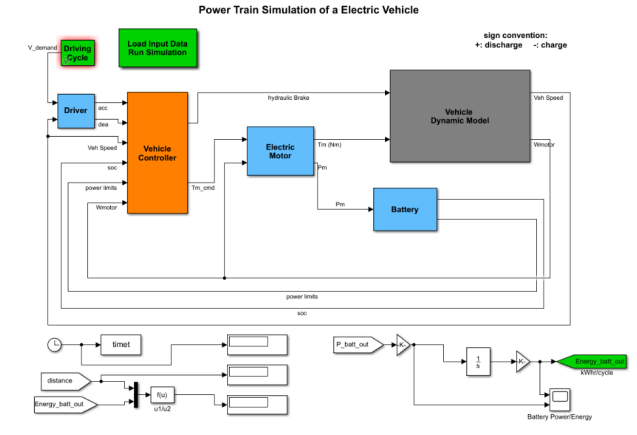
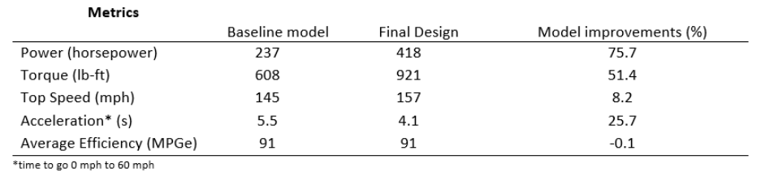

# Electric AWD Sedan Electric Drive Analysis
This report compares simulation results using Matlab/Simulink analyzing the performance of all-wheel drive EVs. The goal is to simulate a design that balances high performance (top speed and acceleration) with drive efficiency by optimizing a transmission system's switching frequency and location (front or rear motor) to the electric drive motors.

[project report PDF link](electric_awd_sedan_report.pdf)

The search for best design utilized an EV powertrain simulink model and varying design inputs from Matlab scripts. The analysis varied inputs such as a baseline model with no transmission, a front or rear transmission location configuration and different gear switching frequencies. 

### Powertrain Simulation Diagram

### Final Results

